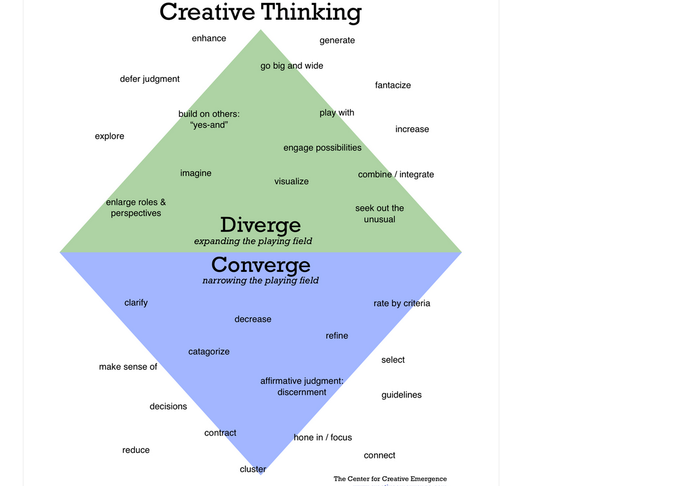

#  Creativity and Critical Thinking.

In a previous video, we looked at **curiosity** and its role in feeding creativity.  Today, we'll examine **creativity** and its importance if your ultimate goal is innovative critical thinking and problem solving.

---
## So What Is So Magical About Creativity?
Well, honestly — nothing.  
Oh, I know it *can* seem magical. But really, it isn't. Here's why:

> **Creativity is in all of us**, although it may be hidden away in some dark corner some of us haven't visited in a long time.
---

## What *Is* Creativity?

There are many definitions out there, but one that stands out is:

> *"The ability to transcend traditional ideas, rules, and patterns, and to create meaningful new ideas."*

Because when it comes down to it, **creating something new and valuable** is the goal.

---

## What Is Creative Thinking?

According to Edward de Bono — one of the great thinkers on creativity:

> **"Creative thinking is a skill. It's not just talent or sitting by a river playing Baroque music hoping to get inspired. That's very weak stuff."**

So what *isn't* the weak stuff?

---

## Where Do Creative Ideas Come From?

Let’s hear from the famously creative **John Cleese**:

> “People ask me where I get my ideas from. I tell them I get them from a Mr. Ken Levingshore in Swindon…  
> He gets them from a lady named Mildred Spong on the Isle of Wight… and she refuses to say where *she* gets them from.”

**The point?** We don't *really* know where ideas come from — but we *do* know they don't come from our laptops.

---

## Don’t Despair — You *Can* Encourage Creativity

Edward de Bono said:

> **"A simple way to spark creativity is just to stop and look."**

Creative thinking is **not a mystery** — it's a capability we all have.  
The key is to find what approaches work best *for you*.

I’ll be sharing several ways to help spark creativity.  
Try as many as you can — not all will work for everyone, and that’s okay.

---

## Divergent Thinking

Creative thinking is a **divergent** type of thinking.  
It’s your brain going off in multiple directions.

> If we all thought alike, humanity wouldn't get very far.  
> Divergent thinking ultimately improves our critical thinking too.

*Divergent thinking* is a cognitive process used to generate many different ideas or solutions to a single open-ended question or problem. It's often associated with creativity, brainstorming, and thinking outside the box.
Key Features of Divergent Thinking:

- Fluency: Producing lots of ideas quickly.
- Flexibility: Thinking in varied categories or perspectives.
- Originality: Coming up with novel or unique ideas.
- Elaboration: Expanding on ideas with detail.

Example:

If asked, “What can you do with a paperclip?” a divergent thinker might say:

1. Hold papers together
2. Make jewelry
3. Pick a lock
4. Build a mini sculpture
5. Use it as a phone reset tool

This contrasts with convergent thinking, which focuses on finding the single best or correct answer, like in a math problem.

---

## Creativity, Curiosity & Critical Thinking

These three are like **spokes on a wheel** — each one reinforcing the others, all leading toward effective problem solving.

---

## Why Is Creative Thinking Important?

Whether in your work life or personal life, creative thinking matters.
A 2014 study by Adobe and Forrester Consulting found:

- 82% of companies believe there’s a strong connection between **creativity** and **business results**
- Creative companies outperform others in **revenue**, **market share**, and **competitive leadership**
- Yet, **61% of companies** do *not* see themselves as creative

---

## How Can You Change This?

In your organization — or even in your own life — change starts by **intentionally encouraging creativity**.

- Encouraging curiosity: Ask open-ended questions and explore unconventional ideas without judgment.

- Creating safe spaces: People need to feel safe to take risks, share ideas, and make mistakes.

- Allowing time and space: Innovation rarely happens under pressure. Set aside dedicated time and distraction-free environments for creative thinking.

- Rewarding experimentation: Celebrate efforts, not just outcomes. Creativity thrives when people feel their ideas are valued.

---

## Key Points Recap

- ✨ Creativity is in all of us — it just needs encouragement  
- 🔀 Creative thinking is **divergent thinking**  
- 📈 Most companies believe creativity drives business success — but many don't feel creative themselves

Stay curious. Stay creative.  
Let's keep building those thinking skills together.

## Creativity

Key Idea: *The key to entering a creative state is to avoid interruptions*.

We often get our best ideas unconsciously, from the part of the mind that works while we sleep. So, how can you create the right mood that allows creativity to flourish?

Think of your creative mind as a shy tortoise. It needs to feel safe before it will come out and explore. If you're constantly stressed or distracted, creativity retreats. That’s why it’s essential to build an "oasis" in your life—a calm, protected space where ideas can emerge. This oasis requires two main things:

- *Boundaries of Space*: Choose a place where you won’t be interrupted. Go for a walk in the park, find a quiet corner, or designate a specific creative zone.

- *Boundaries of Time*: Set clear starting and ending times for your creative sessions. Structure gives freedom for ideas to arise.

Remember, we don’t always know where our ideas come from—but it’s definitely not from forcing ourselves in front of a laptop. Ideas often arrive when we are relaxed, daydreaming, or doing something unrelated.

And here’s a thought-provoking insight: Knowing how good you are at something requires the same skills needed to be good at it. In other words, if you're truly bad at something, you may also lack the ability to recognize your own lack of skill. This is a profound realization—many people are unaware of their own limitations simply because they don't have the tools to recognize them.

## Different Types of Thinking in Creativity

Creative thinking depends on a balance between two core mental processes: divergent thinking and convergent thinking. You can't succeed by focusing on one while neglecting the other — yet many organizations tend to overemphasize convergent thinking.
What Is Divergent Thinking?

Divergent thinking is about generating possibilities. It's the process of expanding your thinking to consider a wide range of ideas, even the unconventional or unusual.

   - Encourages openness to all possibilities
   - Avoids prematurely rejecting ideas
   - Stimulates creativity by asking, “What else could it be?”

## What Is Convergent Thinking?

*Convergent thinking*, on the other hand, is about narrowing choices and making decisions. It involves applying logic and judgment to select the best idea from many.
- Involves evaluating and refining ideas
- Clarifies and focuses thinking
- Helps move from ideas to action

Both are essential. The creative process requires generating a range of ideas (*divergent thinking*) and then choosing and refining the best ones (*convergent thinking()).

## Concrete vs. Abstract Thinking

In our busy world, we tend to focus on concrete thinking, like:

    *"I have a deadline to finish this project by Tuesday."*

But abstract thinking opens up new perspectives:

    *"Are deadlines the best way to get projects done on time?"*

By starting with broader, more open-ended questions, you allow your mind to explore and connect unexpected ideas. This shift can lead to surprising and innovative outcomes.

## Thin vs. Thick Thinking

Another way to improve creative thinking is to practice thin and thick thinking:

- *Thin thinking*: Basic, surface-level questions (Who? What? Where? When? How?)
- *Thick thinking*: Deeper, more exploratory questions (What if? Why? What would happen if...?)

Thick thinking pushes your mind beyond the obvious, leading to richer insights and more original ideas.

### Example Exercise:

Scenario: There is a dog in the office.

- Thin thinking: "What is a dog doing here?"
- Thick thinking:
        "What if the dog is here to help one of my coworkers?"

        "How might we make dog visits more comfortable and productive for everyone?"

## Recap

-  Divergent thinking = Creating choices
-  Convergent thinking = Making choices
Both are necessary for effective creativity.

- Concrete and abstract thinking expand your mental perspective
- Thin and thick thinking help you ask better questions, leading to better ideas

